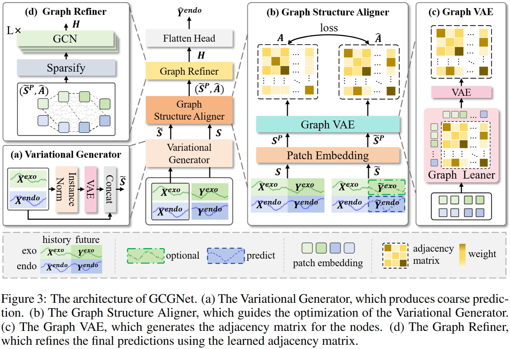
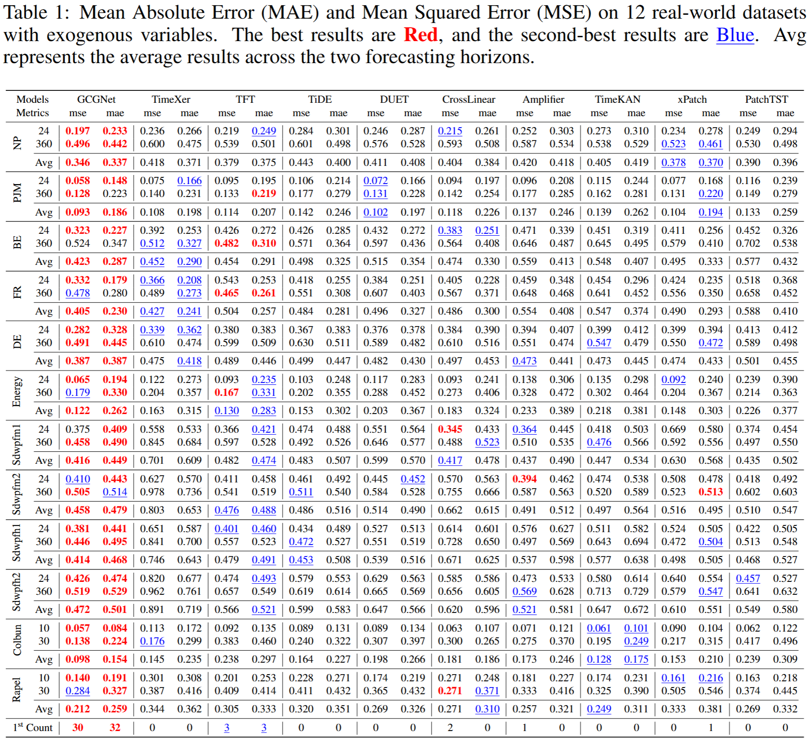

#  GCGNet: Graph-Consistent Generative Network for Time Series Forecasting with Exogenous Variables

[](https://www.python.org/)  [](https://pytorch.org/)

This code is the official PyTorch implementation of our paper: GCGNet: Graph-Consistent Generative Network for Time Series Forecasting with Exogenous Variables.

If you find this project helpful, please don't forget to give it a ⭐ Star to show your support. Thank you!

## Introduction
GCGNet, a Graph-Consistent Generative Network aims to robustly ensure that the temporal and channel correlations between predicted future endogenous variables and known historical endogenous, exogenous, and future exogenous variables are consistent with those of the true future endogenous variables. This consistency helps improve prediction accuracy. 

<div align="center">

</div>

## Quickstart

> [!IMPORTANT]
> this project is fully tested under python 3.8, it is recommended that you set the Python version to 3.8.
1. Requirements

Given a python environment (**note**: this project is fully tested under python 3.8), install the dependencies with the following command:

```shell
pip install -r requirements.txt
```

2. Data preparation

You can obtained the well pre-processed datasets from [Google Drive](https://drive.google.com/file/d/1Pdw5MNG04u1AXQ1eR3g4ds_jmdLYpqUk/view?usp=sharing). Then place the downloaded data under the folder `./dataset`. 

3. Train and evaluate model

- To see the model structure of GCGNet,  [click here](./ts_benchmark/baselines/GCGNet).
- We provide all the experiment scripts for GCGNet under the folder `./scripts/forecasting`.  For example you can reproduce all the experiment results as the following script:

```shell
sh ./scripts/forecasting/GCGNet.sh
```


## Results
We utilize the Time Series Forecasting Benchmark (TFB) code repository as a unified evaluation framework, providing access to **all baseline codes, scripts, and results**. Following the settings in TFB, we do not apply the **"Drop Last"** trick to ensure a fair comparison.

<div align="center">

</div>

